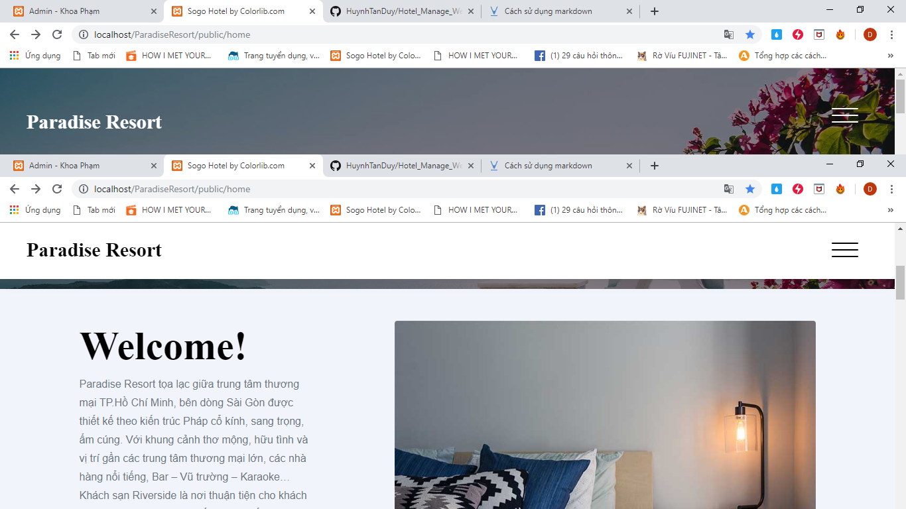

## About Paradise Resort’s Website

It is a web application with gorgeous interface and fully basic function. . 
- Author: Huynh Tan Duy.
- Language: Html,css,javascript for Front-end and PHP-Laravel Framework for Back-end.
- Funtion: Introduce information, Event, Restaurand’s menu; Booking; Manage,Payment.

## Interface & Function

## Conclusion
I’m very appreciate about your caring. Hope you will enjoy and satify about my website. If you have any question, feel free to leave a message at tanduyht@gmail.com.

## Update  
I updated sql file in database/hotelmanage.sql if you need to create database.
 

